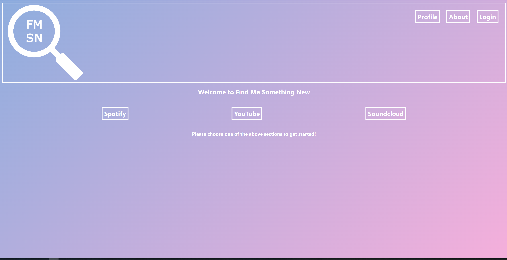

# 

-[Description](#description) -[Purpose](#purpose) -[Usage](#usage) -[Mock-up](#) -[Credits](#credits) -[License](#license)

## Description

Find Me Something New is a MERN application where users can find randomly generated songs with a low amount of streams.

## Purpose

This application was built to showcase a full stack MERN application as well as allow users to find new content specifically that has a relatively low amount of streams.

## Usage

1. Find Me Something New is available <a href="https://fmsn.herokuapp.com/" target="_blank">Here!</a>

## Mock-Up

## Credits

<a href="https://github.com/willhaberer" target="_blank">Will Haberer</a>
<a href="https://github.com/teddysahr" target="_blank">Teddy Sahr</a>

## License

MIT License

Copyright (c) [2022]
